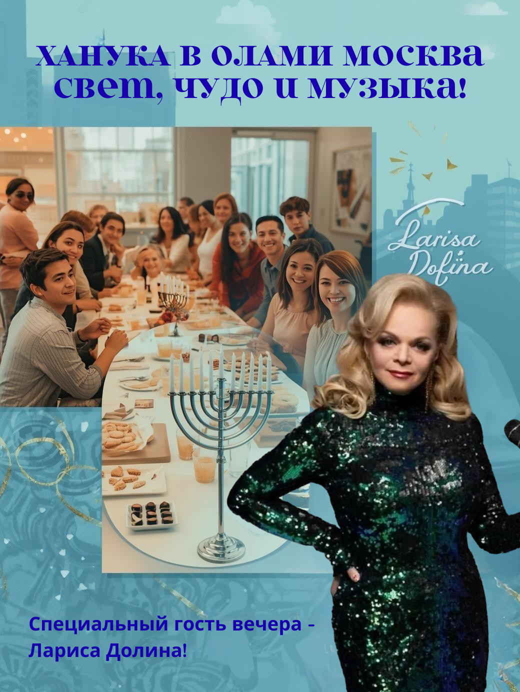
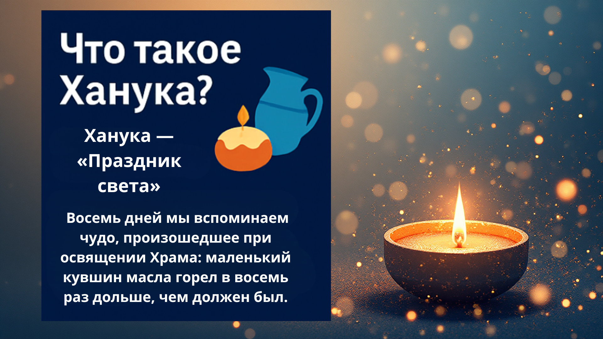
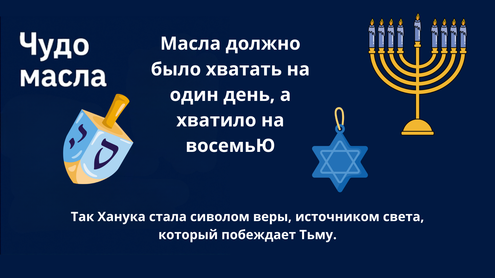
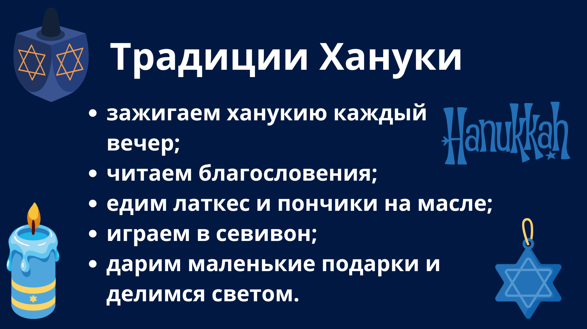
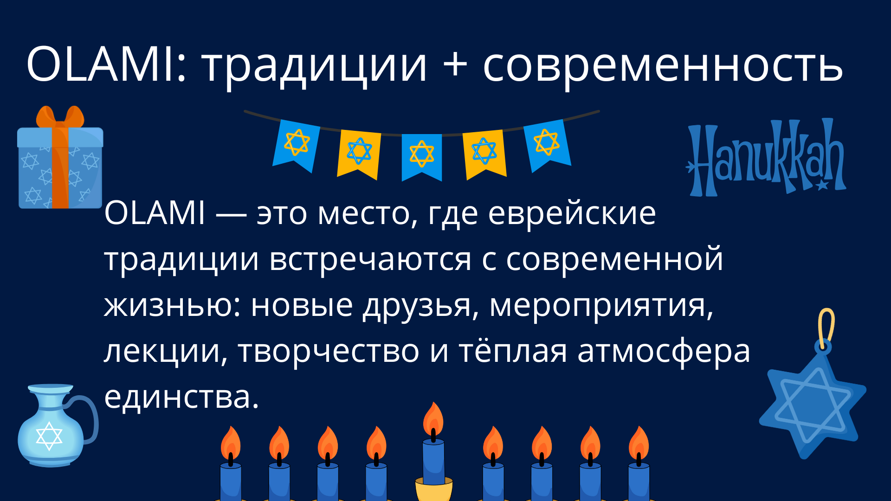

# Olami-Event
Olami Hanukkah Event Show
Ханука в OLAMI: учебный проект с визуалом и каруселью

Учебный проект, посвящённый созданию визуального и текстового контента для соцсетей, сайтов и презентаций на тему еврейского праздника Ханука, основанный на стилистике и духе сообщества OLAMI Moscow.

В проект входит:

концепция визуала (обложки) с участием приглашённого гостя — Ларисы Долиной (в рамках учебной фантазии),

полностью готовая карусель из 8 слайдов,

пример HTML/CSS-баннера,

текст для соцсетей,

файловая структура проекта.

⚠️ Важно: участие Ларисы Долиной используется как учебная идея, не является реальным анонсом мероприятия.

📸 1. Фото-концепт (для генерации / Canva)

Промпт для генерации изображения:

Яркая обложка для соцсетей в современном стиле, формат 4:5. В центре — праздничная ханукальная сцена в молодежном центре: за длинным столом сидят юноши и девушки, на столе суфганиёт, латкес, свечи. На переднем плане — ханукия с огнями. На фоне — современная Москва. Справа — стилизованный портрет Ларисы Долиной: элегантная женщина с микрофоном, улыбается, будто поёт. Цветовая палитра в стиле OLAMI (синий, бирюзовый, золотой). Вверху надпись: «Ханука в OLAMI: свет, чудо и музыка».

🖼️ 2. Карусель (8 слайдов)
Слайд 1 — Обложка

Ханука в OLAMI: свет, чудо и музыка
Представь, что на ханукальный вечер приходит Лариса Долина — вдохновлять, петь и зажигать огни вместе с молодёжью OLAMI Moscow.

Слайд 2 — Что такое Ханука?

Ханука — «Праздник света». Восемь дней мы вспоминаем чудо, произошедшее при освящении Храма: маленький кувшин масла горел в восемь раз дольше, чем должен был.

Слайд 3 — Чудо масла

Масла должно было хватить на один день, но оно горело восемь.
Так Ханука стала символом веры, стойкости и света, который побеждает тьму.

Слайд 4 — Традиции Хануки

зажигаем ханукию каждый вечер;

читаем благословения;

едим латкес и пончики на масле;

играем в севивон;

дарим маленькие подарки и делимся светом.

Слайд 5 — OLAMI: традиции + современность

OLAMI — это место, где еврейские традиции встречаются с современной жизнью: новые друзья, мероприятия, лекции, творчество и тёплая атмосфера единства.

Слайд 6 — В гостях Лариса Долина (концепт)

Представь ханукальный вечер, где Лариса Долина делится музыкой и вдохновением.
Мы говорим о свете внутри каждого и о том, как творчество помогает нести его в мир.

Заметка: образ гостя использован в учебном проекте.

Слайд 7 — Личный смысл Хануки

Ханука — это вопрос к себе:

Где мой внутренний свет?

Какой огонёк я хочу зажечь?

Что хорошего я могу принести другим?

# Обложка проекта

# Слайд 1 — Что такое Ханука?

# Слайд 2 — Чудо масла

# Слайд 3 — Традиции Хануки

# Слайд 4 — Ханука в OLAMI

# Слайд 5 — Ханука в OLAMI

Слайд 8 — Призыв / CTA

Праздник — это люди.
Зажигай свет вместе с OLAMI, следи за мероприятиями и будь частью тёплого еврейского комьюнити.
👉 olami.moscow
